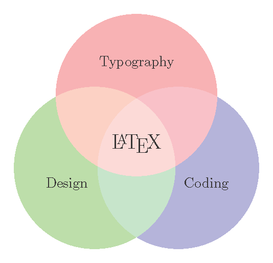

# TikZ Collection


  [](https://github.com/kaicheng001/TikZ-Collection)&nbsp;
  [](https://github.com/kaicheng001/TikZ-Collection/blob/main/LICENSE)&nbsp;
  [](https://github.com/kaicheng001/TikZ-Collection?style=social)


A comprehensive collection of various TikZ diagrams, plots, and examples designed to aid LaTeX users in creating high-quality graphics with ease.

---

## Table of Contents

- [Introduction](#introduction)
- [Features](#features)
- [Directory Structure](#directory-structure)
- [Installation](#installation)
- [Usage](#usage)
  - [Including Examples](#including-examples)
  - [Using Snippets](#using-snippets)
- [Examples](#examples)
  - [Venn Diagrams](#venn-diagrams)
  - [Plots](#plots)
  - [Diagrams](#diagrams)
- [Templates](#templates)
- [Contributing](#contributing)
- [License](#license)
- [Contact](#contact)
- [Acknowledgements](#acknowledgements)

---

## Introduction

Welcome to the **TikZ Collection** repository! TikZ is a powerful package for creating graphics programmatically within LaTeX documents. This repository aims to provide a wide array of pre-made TikZ examples, including Venn diagrams, various plots, flowcharts, mind maps, and other interesting and useful diagrams. Whether you're a beginner looking to learn TikZ or an experienced user seeking ready-to-use graphics, this collection has something for you.

---

## Features

- **Diverse Categories:** Includes Venn diagrams, plots, flowcharts, mind maps, and more.
- **Well-Documented:** Each example comes with detailed comments and explanations.
- **Easy to Use:** Copy and paste code snippets directly into your LaTeX documents.
- **Customizable:** Easily modify examples to fit your specific needs.
- **Organized Structure:** Clearly categorized directories for effortless navigation.
- **Regular Updates:** Continuously adding new examples and improving existing ones.

---

## Directory Structure

```
TikZ-Collection/
│
├── README.md
├── LICENSE
├── .gitignore
├── examples/
│   ├── venn/
│   │   ├── basic_venn.tex
│   │   └── advanced_venn.tex
│   ├── plots/
│   │   ├── line_plot.tex
│   │   └── bar_plot.tex
│   ├── diagrams/
│   │   ├── flowchart.tex
│   │   └── mindmap.tex
│   └── ...
├── snippets/
│   ├── venn/
│   │   ├── basic_venn.tex
│   │   └── advanced_venn.tex
│   ├── plots/
│   │   ├── line_plot.tex
│   │   └── bar_plot.tex
│   ├── diagrams/
│   │   ├── flowchart.tex
│   │   └── mindmap.tex
│   └── ...
├── images/
│   ├── venn/
│   │   ├── basic_venn.png
│   │   └── advanced_venn.png
│   ├── plots/
│   │   ├── line_plot.png
│   │   └── bar_plot.png
│   ├── diagrams/
│   │   ├── flowchart.png
│   │   └── mindmap.png
│   └── ...
├── templates/
│   ├── basic_template.tex
│   ├── advanced_template.tex
│   └── ...
└── docs/
    ├── contributing.md
    └── ...
```

- **`examples/`**: Contains complete LaTeX example files for each category.
- **`snippets/`**: Reusable TikZ code snippets categorized by type.
- **`images/`**: Rendered images of the TikZ diagrams for quick previews.
- **`templates/`**: LaTeX templates that integrate TikZ examples.
- **`docs/`**: Documentation including contribution guidelines and tutorials.

---

## Installation

To get started with the TikZ Collection, clone the repository to your local machine:

```bash
git clone https://github.com/yourusername/TikZ-Collection.git
```

Navigate to the project directory:

```bash
cd TikZ-Collection
```

Ensure you have LaTeX installed on your system. You can download it from [LaTeX Project](https://www.latex-project.org/get/).

---

## Usage

### Including Examples

1. **Locate the Desired Example:**

   Browse through the `examples/` directory to find the TikZ diagram you need.

2. **Copy the TikZ Code:**

   Open the `.tex` file of your chosen example and copy the TikZ code.

3. **Paste into Your LaTeX Document:**

   Insert the TikZ code into your LaTeX document within the `tikzpicture` environment.

   ```latex
   \documentclass{article}
   \usepackage{tikz}
   \begin{document}

   \begin{tikzpicture}
   % Paste TikZ code here
   \end{tikzpicture}

   \end{document}
   ```

4. **Compile Your Document:**

   Compile your LaTeX document using your preferred LaTeX editor or command-line tool to see the rendered diagram.

### Using Snippets

For reusable components, you can utilize the code snippets provided in the `snippets/` directory.

1. **Include the Snippet File:**

   Use the `\input{}` command to include a snippet in your LaTeX document.

   ```latex
   \documentclass{article}
   \usepackage{tikz}
   \begin{document}

   \begin{tikzpicture}
   \input{snippets/venn/basic_venn.tex}
   \end{tikzpicture}

   \end{document}
   ```

2. **Customize as Needed:**

   Modify the included snippet to fit the specific requirements of your project.


---

## Examples

Explore some of the featured examples below. Each example is accompanied by a preview image and a link to the corresponding `.tex` file.

### Venn Diagrams

Venn diagrams are useful for illustrating logical relationships between different sets.

- **Basic Venn Diagram**

  

  [View Code](examples/venn/basic_venn.tex)

- **Advanced Venn Diagram**

  

  [View Code](examples/venn/advanced_venn.tex)

### Plots

Create various types of plots for data visualization.

- **Line Plot**

  

  [View Code](examples/plots/line_plot.tex)

- **Bar Plot**

  

  [View Code](examples/plots/bar_plot.tex)

### Diagrams

Design flowcharts, mind maps, and other structural diagrams.

- **Flowchart**

  

  [View Code](examples/diagrams/flowchart.tex)

- **Mind Map**

  

  [View Code](examples/diagrams/mindmap.tex)

---

## Templates

Use our LaTeX templates to quickly integrate TikZ diagrams into your documents.

- **Basic Template**

  A simple template to get you started with TikZ.

  [Download](templates/basic_template.tex)

- **Advanced Template**

  An advanced template with additional packages and settings for complex diagrams.

  [Download](templates/advanced_template.tex)


---

## Contributing

We welcome contributions from the community! Whether you want to add new diagrams, improve existing ones, or enhance the documentation, your efforts are highly appreciated.

### How to Contribute

1. **Fork the Repository:**

   Click the "Fork" button at the top right of this page to create your own copy of the repository.

2. **Clone Your Fork:**

   ```bash
   git clone https://github.com/yourusername/TikZ-Collection.git
    ```


3. **Create a New Branch:**

   ```bash
   git checkout -b feature/your-feature-name
   ```

4. **Make Your Changes:**

   - Add new examples or snippets in the appropriate directories.
   - Update documentation as needed.

5. **Commit Your Changes:**

   ```bash
   git commit -m "Add [description of your changes]"
   ```

6. **Push to Your Fork:**

   ```bash
   git push origin feature/your-feature-name
   ```

7. **Create a Pull Request:**

   Go to the original repository and click "Compare & pull request" to submit your changes for review.

### Guidelines

- **Code Quality:** Ensure your TikZ code is clean, well-documented, and follows existing naming conventions.
- **Documentation:** Provide clear descriptions and comments for new examples.
- **Testing:** Compile your LaTeX documents to verify that the diagrams render correctly.
- **Respect Licensing:** Ensure that any contributions comply with the project's licensing terms.

For more detailed guidelines, please refer to our [Contributing Guidelines](docs/contributing.md).

---

## License

This project is licensed under the [MIT License](LICENSE). You are free to use, modify, and distribute the code as per the terms of the license.

---

## Contact

If you have any questions, suggestions, or feedback, feel free to reach out!

- **GitHub Issues:** [Open an Issue](https://github.com/yourusername/TikZ-Collection/issues)
- **Email:** [youremail@example.com](mailto:youremail@example.com)

---

## Acknowledgements

- **TikZ & PGF:** Thanks to the creators of the TikZ and PGF packages for making powerful graphics creation accessible within LaTeX.
- **Open Source Community:** Appreciation to all contributors and users who help improve this collection.
- **Inspiration:** Various tutorials and examples from the LaTeX community that inspired the creation of this repository.

---
